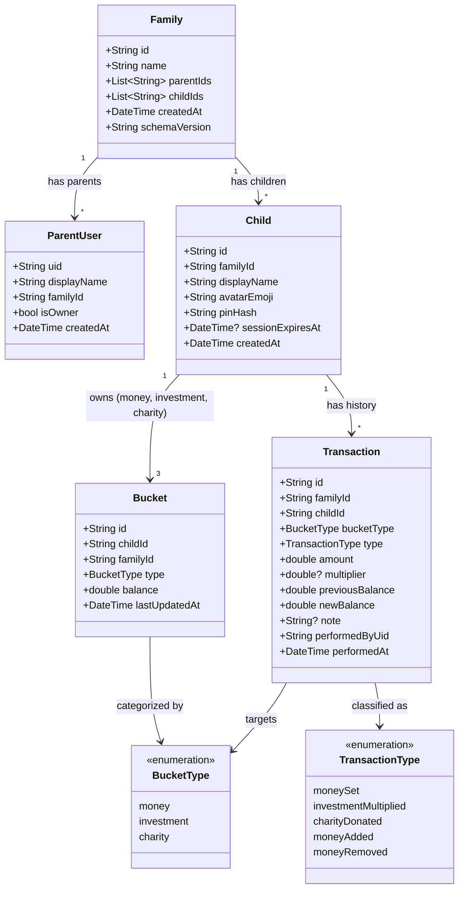
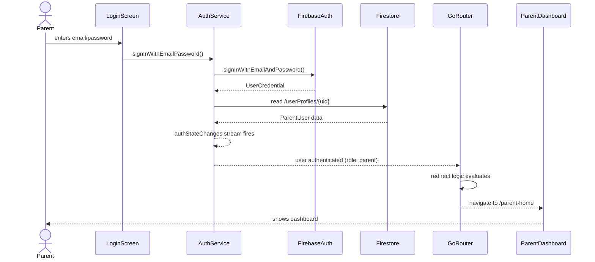
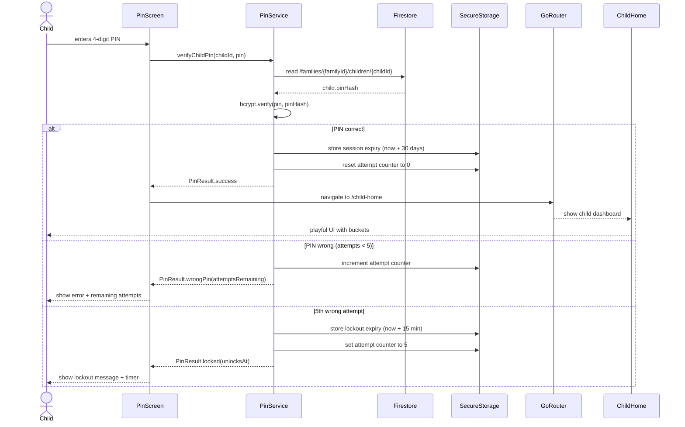
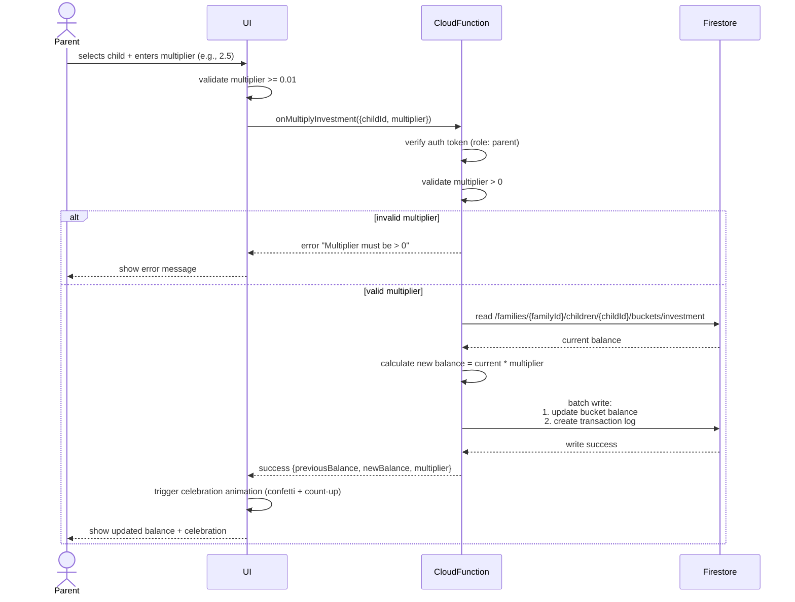
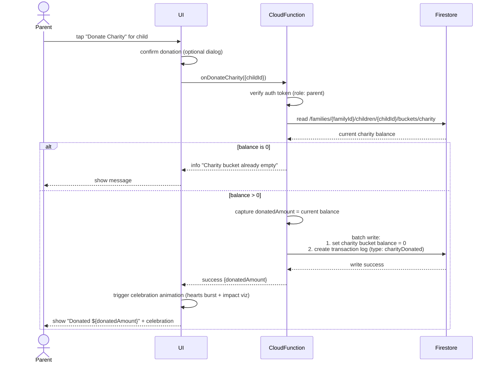
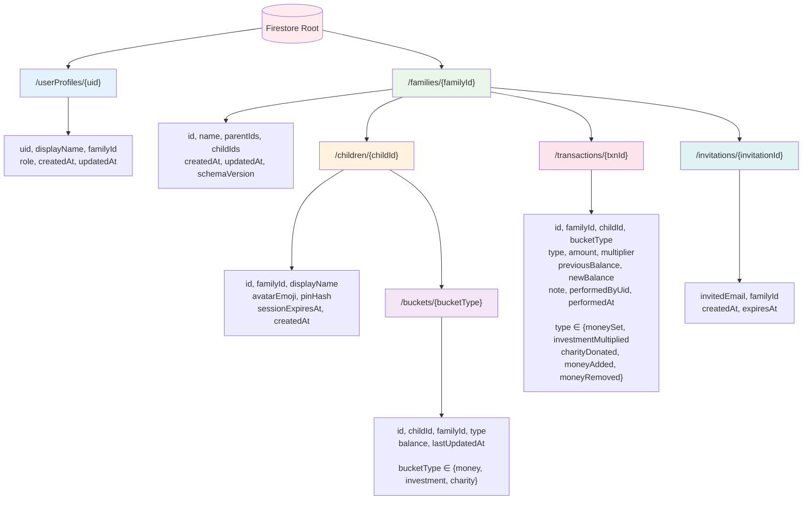
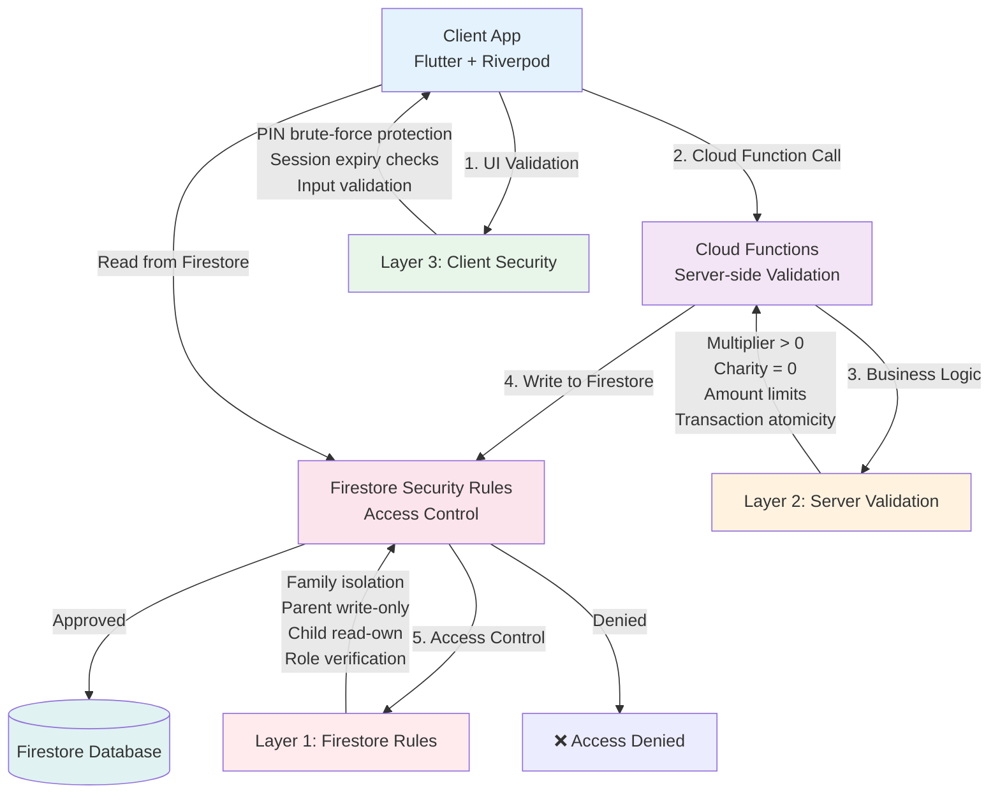

# Phase 1 Summary — KidsFinance Foundation

**Project:** KidsFinance — Financial literacy app for kids  
**Phase:** 1 — Foundation & Architecture  
**Status:** ✅ Complete  
**Date:** 2026-04-05  
**Team:** Iron Man Universe Squad

---

## 1. Phase 1 Overview

### What Was Built

#### Stark (Tech Lead)
- **Project Foundation:** Initialized Flutter project with Firebase integration, Riverpod state management, GoRouter navigation
- **Architecture Decisions:** Established feature-first folder structure, repository pattern, Freezed code generation standards
- **Core Infrastructure:** Set up app constants, dual-theme system (parent/child modes), router with auth-based redirects

#### JARVIS (Backend Lead)
- **Data Model Design:** Created comprehensive domain models using Freezed: Family, ParentUser, Child, Bucket, Transaction
- **Repository Pattern:** Implemented Firebase repositories for all entities with proper abstraction layers
- **Firestore Schema:** Designed family-centric hierarchy with immutable transaction logs and composite indexes

#### Fury (Security Lead)
- **Authentication System:** Implemented dual-tier auth (Firebase Auth for parents, PIN-based for children)
- **Firestore Security Rules:** Created comprehensive role-based rules with family isolation and child read-only enforcement
- **PIN Security:** Designed bcrypt-based PIN hashing with brute-force protection (5 attempts, 15-min lockout)

### App Status

#### ✅ What Works Now
- Firebase project initialized with authentication and Firestore
- Parent login with email/password and Google Sign-In
- Family creation and profile management
- Complete data model with type-safe domain entities
- Repository pattern for all data access
- Firestore security rules enforcing family isolation and role-based access
- Router with auth state redirects
- Dual theme system (parent/child modes)

#### 🔜 What's Pending
- Child PIN authentication screens (Pepper)
- Parent dashboard UI (Rhodey)
- Child dashboard UI (Pepper)
- Bucket management screens (Rhodey + Pepper)
- Transaction history and detail views (Rhodey)
- Investment multiply and charity donation flows
- Celebration animations (Pepper)
- Cloud Functions for server-side validation
- Comprehensive testing (Happy)

### Metrics
- **Files:** 32 Dart files
- **Lines of Code:** ~1,970 lines
- **Features:** 5 (auth, family, children, buckets, transactions)
- **Domain Models:** 6 (Family, ParentUser, Child, Bucket, Transaction, AppUser)
- **Repositories:** 4 (Family, Child, Bucket, Transaction)
- **Security Rules:** 120 lines covering 8 boundary conditions

---

## 2. Project Structure Diagram

```mermaid
graph TD
    lib[lib/] --> core[core/]
    lib --> features[features/]
    lib --> routing[routing/]
    
    core --> constants[constants/]
    core --> theme[theme/]
    
    constants --> app_constants[app_constants.dart]
    theme --> app_theme[app_theme.dart]
    
    features --> auth[auth/]
    features --> family[family/]
    features --> children[children/]
    features --> buckets[buckets/]
    features --> transactions[transactions/]
    
    auth --> auth_data[data/]
    auth --> auth_domain[domain/]
    auth --> auth_providers[providers/]
    auth --> auth_presentation[presentation/]
    
    family --> family_data[data/]
    family --> family_domain[domain/]
    family --> family_providers[providers/]
    
    children --> children_data[data/]
    children --> children_domain[domain/]
    children --> children_providers[providers/]
    
    buckets --> buckets_data[data/]
    buckets --> buckets_domain[domain/]
    buckets --> buckets_providers[providers/]
    
    transactions --> transactions_data[data/]
    transactions --> transactions_domain[domain/]
    transactions --> transactions_providers[providers/]
    
    routing --> app_router[app_router.dart]
    
    style lib fill:#e1f5ff
    style core fill:#fff4e1
    style features fill:#e8f5e9
    style routing fill:#fce4ec
```



---

## 3. Data Model — Class Diagram



---

## 4. Auth Flow — Sequence Diagrams

### 4a. Parent Login Flow



### 4b. Child PIN Auth Flow



### 4c. Parent Investment Multiply Flow



### 4d. Charity Donation Flow



---

## 5. Firestore Data Hierarchy



**Key Design Decisions:**
- **Family-centric isolation:** All child data lives under `/families/{familyId}` for atomic queries
- **Immutable transaction log:** Every bucket mutation creates a transaction record
- **Composite index:** `(childId ASC, performedAt DESC)` for fast history queries
- **Schema versioning:** `schemaVersion: "1.0.0"` in family doc enables future migrations

---

## 6. GoRouter Navigation Map

```mermaid
graph LR
    Start([App Launch]) --> Splash[/splash]
    
    Splash --> CheckAuth{Auth State?}
    
    CheckAuth -->|Not Authenticated| Login[/login]
    CheckAuth -->|Authenticated| CheckRole{User Role?}
    
    CheckRole -->|Parent| ParentHome[/parent-home]
    CheckRole -->|Child| ChildPin[/child-pin]
    
    Login -->|Sign In Success| CheckRole
    Login -->|Google Sign In| CheckRole
    Login -->|Create Account| FamilySetup[/family-setup]
    
    FamilySetup -->|Complete| ParentHome
    
    ChildPin -->|PIN Verified| ChildHome[/child-home]
    ChildPin -->|5 Failed Attempts| Lockout[Lockout Screen<br/>15 min timer]
    
    Lockout -->|Timer Expires| ChildPin
    
    ParentHome -->|Manage Children| ChildList[Child Management]
    ParentHome -->|View Transactions| TransactionHistory
    ParentHome -->|Multiply Investment| InvestmentFlow
    ParentHome -->|Donate Charity| CharityFlow
    
    ChildHome -->|View Buckets| BucketView[Bucket Details]
    ChildHome -->|Session Expired| ChildPin
    
    style Start fill:#e3f2fd
    style Splash fill:#fff3e0
    style Login fill:#e8f5e9
    style ParentHome fill:#f3e5f5
    style ChildHome fill:#fce4ec
    style ChildPin fill:#ffebee
```

**Redirect Logic:**
1. **Splash → Login:** If `authState.value == null`
2. **Login → Parent Home:** If authenticated AND `role == 'parent'`
3. **Login → Child PIN:** If authenticated AND `role == 'child'`
4. **Child PIN → Child Home:** After successful PIN verification
5. **Session Expiry:** Child home redirects to PIN screen after 30 days

---

## 7. Security Architecture



### Layer 1: Firestore Security Rules
**Purpose:** Enforce data access boundaries at the database level  
**Key Rules:**
- ✅ Parents can read/write their own family data
- ✅ Children can read only their own buckets and transactions
- ✅ Children cannot write to any Firestore documents
- ✅ Family isolation: users can only access data for their `familyId`
- ✅ Custom claims verification: `request.auth.token.role` and `request.auth.token.familyId`

### Layer 2: Cloud Functions
**Purpose:** Server-side business logic validation  
**Key Validations:**
- ✅ Investment multiplier must be > 0 (rejects zero/negative)
- ✅ Charity donation sets balance to exactly 0
- ✅ Atomic batch writes: bucket update + transaction log together
- ✅ Balance calculations: `newBalance = previousBalance * multiplier`
- ✅ Auth token verification before every operation

### Layer 3: Client Security
**Purpose:** User experience and local protection  
**Key Features:**
- ✅ PIN brute-force protection: 5 attempts, then 15-minute lockout
- ✅ bcrypt password hashing (cost factor 10)
- ✅ Session expiry: 30 days, stored in secure storage
- ✅ Attempt counter and lockout timer in secure storage
- ✅ No PIN storage in memory after verification

---

## 8. Key Constants & Configuration

| Constant | Value | Purpose | Defined In |
|----------|-------|---------|------------|
| `PIN_LENGTH` | 4 | Child PIN digit count | `app_constants.dart` |
| `PIN_MAX_ATTEMPTS` | 5 | Maximum wrong PIN attempts before lockout | `app_constants.dart` |
| `PIN_LOCKOUT_MINUTES` | 15 | Duration of lockout after 5 failed attempts | `app_constants.dart` |
| `CHILD_SESSION_DAYS` | 30 | Days before child session auto-expires | `app_constants.dart` |
| `INVESTMENT_MIN_MULTIPLIER` | 0.01 | Minimum multiplier value (must be > 0) | `app_constants.dart` |
| `TRANSACTION_ARCHIVE_YEARS` | 1 | Years before transactions are archived | `app_constants.dart` |
| `SCHEMA_VERSION` | "1.0.0" | Current Firestore schema version | `family.dart` |
| `BUCKET_TYPES` | money, investment, charity | Three bucket categories per child | `bucket.dart` |
| `TRANSACTION_TYPES` | moneySet, investmentMultiplied, charityDonated, moneyAdded, moneyRemoved | All transaction categories | `transaction.dart` |
| `USER_ROLES` | parent, child | Two role types in auth system | `app_constants.dart` |

**Configuration Files:**
- **`firebase_options.dart`:** Firebase project configuration (auto-generated by FlutterFire CLI)
- **`firestore.rules`:** Security rules (120 lines)
- **`app_constants.dart`:** App-wide constants (27 lines)
- **`.squad/decisions.md`:** Architectural decisions log (150+ lines)

---

## 9. Phase Status & Next Steps

### ✅ Phase 1 Complete — Foundation Built

**Completed Deliverables:**
- [x] Flutter project initialized with Firebase SDK
- [x] Feature-first folder structure established
- [x] Repository pattern implemented for all entities
- [x] Domain models defined with Freezed (Family, ParentUser, Child, Bucket, Transaction)
- [x] Firestore security rules with family isolation and role-based access
- [x] Parent authentication (email/password + Google Sign-In)
- [x] Child PIN security design (bcrypt, brute-force protection)
- [x] GoRouter with auth-based redirects
- [x] Dual theme system (parent/child modes)
- [x] Core constants and configuration
- [x] Architectural decisions documented

**Key Achievements:**
- **Security:** Three-layer security model (Firestore Rules + Cloud Functions + Client)
- **Data Integrity:** Immutable transaction log for audit trail
- **Scalability:** Family-centric hierarchy supports multi-parent, multi-child
- **Type Safety:** Freezed models with code generation
- **Maintainability:** Feature-first structure, repository pattern, clear separation of concerns

---

### 🔜 Phase 2 — Dashboards & Core UI (Rhodey + Pepper)

**Objectives:** Build parent and child dashboard screens with bucket displays

**Rhodey (Frontend Lead) — Parent Dashboard:**
- [ ] Parent home screen layout (data-dense, efficient)
- [ ] Child list with bucket summary cards
- [ ] Add/edit child functionality
- [ ] Transaction history list view
- [ ] Search and filter transactions
- [ ] Investment multiply UI
- [ ] Charity donation UI

**Pepper (UI/UX Lead) — Child Dashboard:**
- [ ] Child home screen (playful, large touch targets)
- [ ] Three bucket cards (money, investment, charity) with emojis
- [ ] Animated balance displays with count-up
- [ ] Child PIN entry screen with brute-force protection UI
- [ ] Lockout screen with countdown timer
- [ ] Session expiry handling

**Shared Work:**
- [ ] Riverpod providers for bucket state
- [ ] Real-time bucket updates via StreamProvider
- [ ] Navigation between parent/child modes
- [ ] Responsive layout (mobile-first, tablet support)

---

### 🔜 Phase 3 — Transactions & Celebrations (Rhodey + Pepper + Happy)

**Objectives:** Implement transaction flows, history views, and celebration animations

**Features:**
- [ ] Cloud Functions for investment multiply and charity donation
- [ ] Transaction creation with batch writes
- [ ] Transaction detail view with full metadata
- [ ] Celebration animations (confetti, hearts burst, coin drop)
- [ ] Transaction filtering by type, child, date range
- [ ] Export transaction history (CSV)
- [ ] Offline queue for pending transactions

**Testing:**
- [ ] Widget tests for all screens
- [ ] Integration tests with Firebase Emulator
- [ ] Security boundary tests (8 test cases)
- [ ] Edge case tests (zero balance, large multipliers, race conditions)

---

### 🔜 Phase 4 — Polish, Testing & Release (Happy + Team)

**Objectives:** Comprehensive testing, performance optimization, and production release

**Quality Assurance:**
- [ ] P0 test suite (30+ tests)
- [ ] Manual QA for kid UX (engagement, delight)
- [ ] Performance profiling (Firestore query optimization)
- [ ] Offline-first validation
- [ ] Multi-parent conflict resolution testing

**Production Readiness:**
- [ ] App store assets (screenshots, descriptions)
- [ ] Privacy policy (COPPA compliance)
- [ ] Terms of service
- [ ] Analytics integration (Firebase Analytics)
- [ ] Crash reporting (Firebase Crashlytics)
- [ ] Production Firebase project setup
- [ ] Beta testing with real families

**Release:**
- [ ] Android release build
- [ ] Google Play Store submission
- [ ] Post-launch monitoring

---

## Architecture Principles

### 1. Feature-First Organization
Every feature is self-contained with its own `data/`, `domain/`, `presentation/`, and `providers/` layers. No cross-feature imports.

### 2. Repository Pattern
All Firebase access goes through repository interfaces. Domain layer never directly touches Firebase SDK.

### 3. Immutability
Freezed models ensure immutable data structures. Transaction log is append-only.

### 4. Type Safety
Code generation (Freezed, Riverpod) eliminates boilerplate and runtime errors.

### 5. Security by Design
Three-layer security ensures no single point of failure. Defense in depth.

### 6. Real-Time First
StreamProvider for bucket balances. FutureProvider for historical data. Offline support via Firebase local cache.

### 7. COPPA Compliance
Children provide only first name, age range, avatar emoji. No email, phone, or DOB collected.

### 8. Dual User Experience
Parent mode: data-dense, efficient, professional (Inter font).  
Child mode: playful, simple, delightful (Nunito font).

---

## Team Contacts

- **Stark (Tech Lead):** Architecture, project setup, technical decisions
- **JARVIS (Backend Lead):** Data models, repositories, Firestore schema
- **Fury (Security Lead):** Authentication, security rules, PIN system
- **Rhodey (Frontend Lead):** Parent UI, transaction flows, data visualization
- **Pepper (UI/UX Lead):** Child UI, celebrations, animations, design system
- **Happy (QA Lead):** Test strategy, edge cases, security boundary tests
- **Scribe:** Documentation, decision log, meeting notes

---

**Document Version:** 1.0  
**Last Updated:** 2026-04-05  
**Author:** Stark (Tech Lead)  
**Reviewed By:** Squad

---

*This document serves as the architectural reference for the KidsFinance project. All team members should familiarize themselves with these diagrams and decisions before beginning Phase 2 work.*
